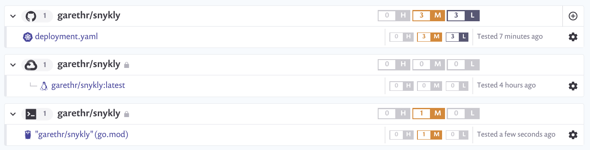

# Snykly

A simple vulnerable Go application used for demonstration purposes.

 

This repository gratuitously uses [Bazel](https://bazel.build/) for the build process. This includes:

* Building and testing the Go application using `go_library`, `go_test` and `go_binary`
* Building and pushing a container image using `container_push`, `container_image`, `container_bundle` and `go_image`
* Deploying to a local Kubernetes cluster using `k8s_object`
* Keeping the Bazel rules up-to-date using `gazelle`

See the [Makefile](Makefile) for usage instructions if you are interested.

You can also use the included `Dockerfile` to build the image from source if you prefer:

```
docker build -t garethr/snykly .
```

And the included Kubernetes deployment file for deploying the application:

```
kubectl apply -f https://raw.githubusercontent.com/garethr/snykly/master/deployment.yaml
```


## Vulnerable?

The application, and the associated image, have a few known vulnerabilities. We can use Snyk to detect them. In this case we're testing the image uploaded to GCR, testing the Go code using GitHub Actions and checking for configuration issues by importing the source repository into Snyk.


